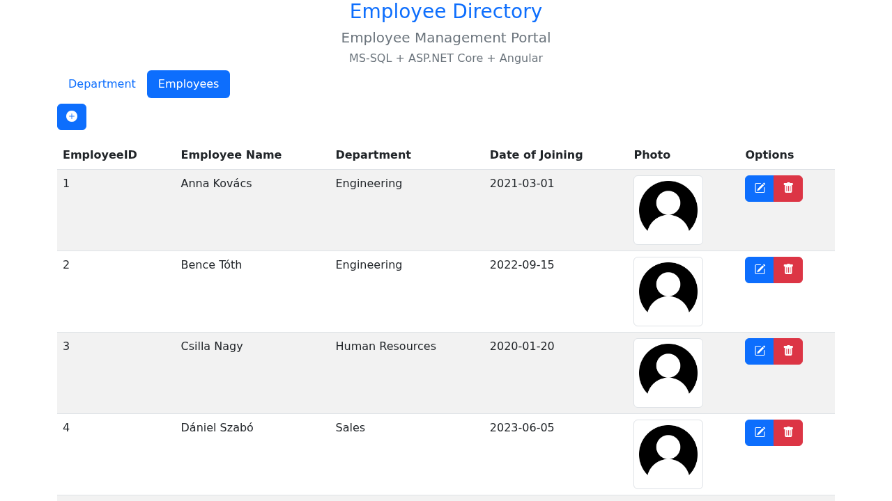

# Employee Directory

A staff directory with departments, employee records and photo uploads. Built
to learn layered API design against a real relational schema — an ASP.NET Core
Web API over MS-SQL, consumed by an Angular single-page client.

**Live demo:** _(not deployed yet — see [docs/DEPLOYMENT.md](docs/DEPLOYMENT.md))_
> First request may take ~30 seconds — free-tier cold start.



## Stack

ASP.NET Core Web API · MS-SQL / SQLite · ADO.NET · Angular · TypeScript · Bootstrap

## What's interesting here

Honestly? It's CRUD. The parts worth a look are the ones where that stopped
being true:

**The data layer is provider-portable without a second set of queries.** It was
written against MS-SQL, but the public demo has to run on a free container,
where SQL Server doesn't fit — it needs ~2 GB of RAM and has no ARM64 build. So
the queries were normalised to the subset MS-SQL and SQLite both understand,
leaving exactly three provider-specific things: the connection, the DDL, and one
date expression. See [`WebAPI/WebAPI/Data/`](WebAPI/WebAPI/Data/). The
interesting constraint was `AddWithValue`, which every ADO.NET tutorial uses and
which doesn't exist on the `DbParameterCollection` base type — so going
provider-neutral means replacing all fourteen calls.

**The schema's missing foreign key costs more than it looks.**
`Employee.Department` is a free-text copy of the department's *name* rather than
a reference to its id. Renaming a department orphans its employees; deleting one
leaves dangling strings that still render. [`schema.sql`](schema.sql) is the
original; [`schema.sqlite.sql`](schema.sqlite.sql) was written fresh for the demo
with the keys and constraints the original lacks, and the diff between them is
the fix.

**Ephemeral data as a design choice.** Free container filesystems reset on
redeploy. Rather than fight it, the database seeds itself on any boot where it
comes up empty, and photos live in the same directory so the two never disagree.
The demo is always populated and nobody's experiments leak into the next
visitor's session.

## Running locally

```bash
podman-compose -f deploy/compose.yaml up --build
```

Frontend on `:4200`, API on `:5221`, SQLite seeded automatically. Without
containers, or to run against real MS-SQL, see
[docs/DEPLOYMENT.md](docs/DEPLOYMENT.md).

## What I'd do differently

This was written in 2022 while learning both halves of the stack, by following
a tutorial. It was unarchived and reviewed in 2026. The full review is in
[docs/CODE-REVIEW.md](docs/CODE-REVIEW.md); the things I'd change, in the order
I'd change them:

**Return DTOs, not `DataTable`.** Every action loads a `DataTable` and returns
it straight as JSON, which means the *database column name is the API contract*.
Rename a column and every client breaks silently. This wasn't theoretical: a
`SELECT *` returned `DepartmentId` while the Angular model read `DepartmentID`,
so the client's id was permanently `undefined` and delete was issuing
`DELETE /api/Department/undefined`. I found that during this review, four years
after shipping it.

**Put the queries behind a repository.** They're built inline in the controller
actions, so there's no seam between HTTP and SQL — which is the real reason
there are no tests, not lack of discipline. Extracting the layer and testing it
are the same piece of work.

**Model the relationship properly.** A `DepartmentId` foreign key instead of a
copied name, plus the primary keys, `NOT NULL` and indexes the original schema
declares nowhere. And `nvarchar`, so Hungarian names survive.

**Raise events instead of passing `this`.** Child components receive their whole
parent as an `@Input()` (`[ShowEmpComp]="this"`) and call methods on it
directly. `@Output()` with an `EventEmitter` is the inverse, and it's what makes
the child reusable and testable. This is the clearest fingerprint of the
tutorial the project came from.

**Validate at the boundary.** Uploads took the client's filename and passed it
to `Path.Combine` after stripping only quotes — a path traversal that let a
crafted filename overwrite files outside the photos directory, on an
unauthenticated endpoint. Fixed, but the lesson generalises: don't sanitise
attacker-controlled input, replace it.

**Check what a write actually did.** Every `ExecuteNonQuery()` return value was
discarded, so deleting a row that didn't exist reported success.

One thing I'd keep: **every SQL statement is parameterised** — fourteen
parameters, no concatenation anywhere, including the paths taking an id straight
from the URL. That's the thing most likely to have gone wrong here, and it
didn't.

## Repository layout

```
WebAPI/WebAPI/          ASP.NET Core Web API
  Controllers/          Employee and Department endpoints
  Data/                 connection factory, SQL dialect helper, seeding
Frontend/               Angular client
deploy/                 Dockerfile and compose
docs/                   code review, deployment notes
schema.sql              MS-SQL schema (original)
schema.sqlite.sql       SQLite schema (demo, with the constraints added)
```

## Dependencies

The frontend is pinned to Angular 14, which is out of support. Upgrading it is
seven major versions, so instead the packages Dependabot flags are pinned to
fixed versions with npm `overrides`, without touching the Angular toolchain.
This brings the tree from 79 flagged packages to 23, and both criticals
(`webpack`, `tar`) are gone.

I did not just trust the version numbers. Every override was checked with a
production build, and then the built bundle was opened in headless Chromium to
see that the app still starts. The bundle hash did not change, which is
expected, because all of these are build-time packages only.

`piscina`, `serialize-javascript` and `minimatch` need Node 20. On Node 18 the
build stops with `crypto is not defined`, so compose and the Cloudflare pin use
Node 20 now — see [docs/DEPLOYMENT.md](docs/DEPLOYMENT.md).

The remaining 23 cannot be fixed from here:

- `@angular/core`, `@angular/common`, `@angular/compiler` — XSS advisories with
  no patch for v14, and npm cannot install v22 next to the v14 peers. These are
  the only findings that reach the browser, but nothing in `src/` uses
  `innerHTML`, `bypassSecurityTrust` or `$localize` in a template.
- `image-size`, `ip` — no released version fixes the advisory.
- `esbuild`, `uuid`, `webpack-dev-server` — moderate, dev server only, and the
  fix needs the Angular 21 builder.

Worth knowing if you see the same pattern: Dependabot proposed doing this by
raising `@angular-devkit/build-angular` from 14 to 21 while leaving Angular
itself at 14. That combination can't install at all — the v21 builder
peer-requires Angular 21 and TypeScript 5.9 — so it fails `npm ci` before a
build is even attempted. Overriding the transitive dependency directly is the
smaller and safer fix.

---

Originally built following
[this tutorial](https://www.youtube.com/watch?v=Dpv6lUKNL9o).
The API is also documented as a
[Postman collection](https://www.postman.com/tudi20/workspace/employeeexamplewebapp).
